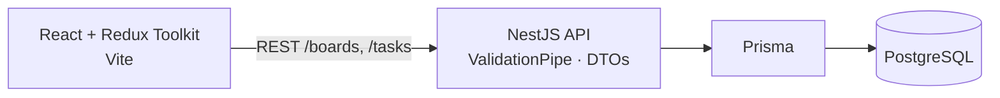

# Kanban Board

[](https://github.com/Shiw4se/kanban-app/actions/workflows/ci.yml)


A Trello-style task board: create a board, share its ID, and drag tasks between **To Do**, **In Progress** and **Done**.
Strict TypeScript on both sides, Prisma migrations, one-command Docker setup and a CI pipeline that lints, tests and builds every push.

## Features

- Boards identified by a short shareable ID — open `/board/<id>` to load one, "New Board" creates a fresh one; the `default` board is created on first visit
- Three columns with drag-and-drop between them (`@hello-pangea/dnd`); the move is applied in the UI immediately and then saved
- Create, edit and delete tasks in a modal; each task has a title, description, status and position
- Deleting a board removes its tasks (cascade)
- Request validation on the API: unknown fields are stripped, status must be one of the three columns

**Under the hood**
- **Optimistic drag-and-drop** — the Redux reducer moves the task first (`moveTask`), then a `PATCH` persists the new status and order, so the board never waits for the network
- **State in Redux Toolkit** — async thunks for loading a board and creating, updating and deleting tasks; API errors are turned into readable messages
- **NestJS modules** per resource (`boards`, `tasks`), each with a controller, service and DTOs validated by `class-validator`
- **Prisma** with versioned migrations; the backend container applies them on start and retries until PostgreSQL is ready
- **CI** on every push and pull request: ESLint and Jest for the backend, ESLint, Vitest and a production build for the frontend

## Architecture



Data model: a `Board` has many `Task`s. A task carries `title`, `description`, `status` (`todo` | `in_progress` | `done`) and `order` inside its column.

## API

| Method | Route | Description |
|---|---|---|
| POST | `/boards` | Create a board (`id`, `title`); `409` if the ID is taken |
| GET | `/boards/:id` | Board with its tasks ordered by position |
| PATCH | `/boards/:id` | Rename a board |
| DELETE | `/boards/:id` | Delete a board and its tasks |
| POST | `/tasks` | Create a task (`title`, `boardId`, optional `description`, `status`, `order`) |
| GET | `/tasks/:id` | One task |
| PATCH | `/tasks/:id` | Update title, description, status or order (used by drag-and-drop) |
| DELETE | `/tasks/:id` | Delete a task |

## Tech stack

| Layer | Technology |
|---|---|
| Frontend | React, Vite, TypeScript, Redux Toolkit, React Router, `@hello-pangea/dnd`, Axios |
| Backend | NestJS, TypeScript, Prisma, class-validator |
| Database | PostgreSQL 15 |
| Tests | Jest + Supertest (API), Vitest + React Testing Library (UI) |
| Tooling | Docker Compose, GitHub Actions, ESLint, Prettier |

## Quick start (Docker)

No local Node.js or PostgreSQL needed.

```bash
git clone https://github.com/Shiw4se/kanban-app.git
cd kanban-app
docker compose up --build
```

- App: http://localhost:5173
- API: http://localhost:3000

The backend container waits for the database, applies the Prisma migrations and starts.

## Local development

Requirements: Node.js 18+ and a running PostgreSQL.

**Backend**

```bash
cd kanban-backend
npm install
cp .env.example .env     # set DATABASE_URL and PORT
npx prisma migrate dev
npm run start:dev
```

**Frontend**

```bash
cd kanban-frontend
npm install              # .env already points at http://localhost:3000
npm run dev
```

## Tests

```bash
cd kanban-backend && npm run test:e2e   # API: create board and task, move task, read, delete
cd kanban-frontend && npm test          # reducer (optimistic move) and board rendering
```

## Project structure

```text
kanban-backend/
  prisma/           schema and migrations
  src/boards/       boards module: controller, service, DTOs
  src/tasks/        tasks module
  src/prisma.service.ts
  test/             API end-to-end tests
kanban-frontend/
  src/components/   KanbanBoard (columns, drag-and-drop, task modal)
  src/hooks/        useKanban — all board logic used by the component
  src/store/        Redux store and board slice
  tests/
docker-compose.yml  PostgreSQL + backend + frontend
.github/workflows/  CI pipeline
```

## Configuration

| Variable | Where | Description |
|---|---|---|
| `DATABASE_URL` | backend | PostgreSQL connection string |
| `PORT` | backend | HTTP port (3000) |
| `VITE_API_URL` | frontend | Backend URL the browser calls |

## Contact

Telegram: [@shiw4se](https://t.me/shiw4se) · Email: [ausenko476@gmail.com](mailto:ausenko476@gmail.com)
